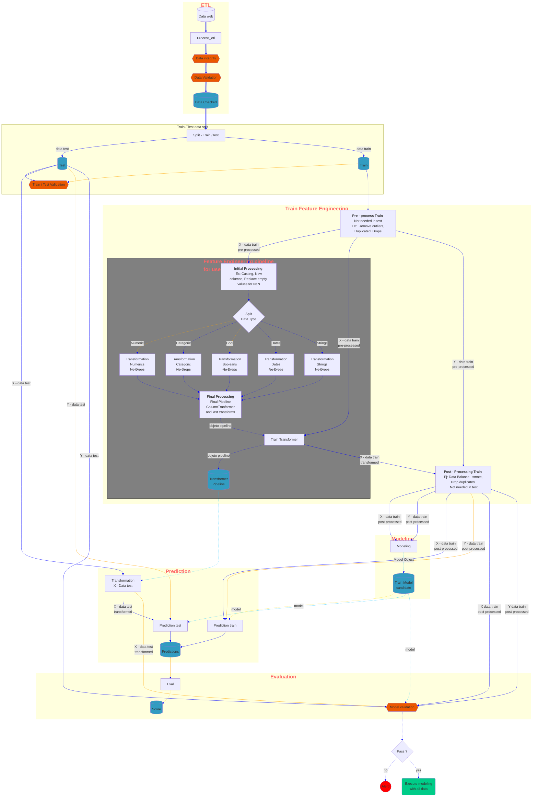
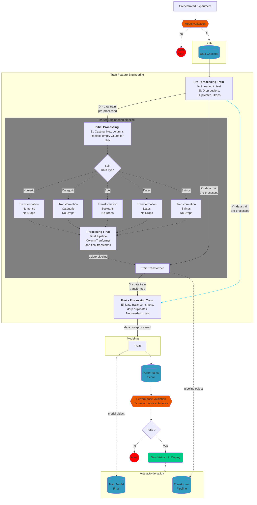

# Demo data science template

[](https://github.com/astral-sh/uv)
[](https://github.com/charliermarsh/ruff)
[](https://github.com/pre-commit/pre-commit)
[](https://github.com/PyCQA/bandit)
[](https://mypy-lang.org/)
[](https://github.com/JoseRZapata/demo-data-science-template/actions/workflows/ci.yml)
[](https://codecov.io/gh/JoseRZapata/demo-data-science-template)
---

This demo of a data science project is created using the template from [@JoseRZapata]'s [data science project template] which have all the necessary tools for experiment, development, testing, and deployment data science From notebooks to production.

> [!WARNING]
> 🚧 Work in progress 🚧, This is a demo project, It is only for educational purposes.

## Install the proyect

In Linux / MAC OS

1. Install [UV](https://docs.astral.sh/uv/) to manage python dependencies and environments
2. clone repository
3. In the root of the proyect only run: `uv sync` to create the environment
4. activate the environment `source .venv/bin/activate`

Enjoy!!

## FastAPI Demo

To run the fastapi demo, you can run the following command:

`fastapi dev src/inference/model_deploy.py`

Then, you can access the API Documentation at <http://127.0.0.1:8000/docs>

## Streamlit Demo

To run the streamlit demo, you can run the following command:

`streamlit run notebooks/7-deploy/titanic-streamlit.py`

## Run Training pipeline

To run the simple training, you can run the following command in the environment:

`python src/pipelines/simple_train_pipeline.py`

Created Trained model will be in: `models/first_basic_model.joblib`

## 🗃️ Project structure

- [Data structure]
- [Pipelines based on Feature/Training/Inference Pipelines](https://www.hopsworks.ai/post/mlops-to-ml-systems-with-fti-pipelines)

```bash
.
├── codecov.yml                         # configuration for codecov
├── .code_quality
│   ├── mypy.ini                        # mypy configuration
│   └── ruff.toml                       # ruff configuration
├── data
│   ├── 01_raw                          # raw immutable data
│   ├── 02_intermediate                 # typed data
│   ├── 03_primary                      # domain model data
│   ├── 04_feature                      # model features
│   ├── 05_model_input                  # often called 'master tables'
│   ├── 06_models                       # serialized models
│   ├── 07_model_output                 # data generated by model runs
│   ├── 08_reporting                    # reports, results, etc
│   └── README.md                       # description of the data structure
├── docs                                # documentation for your project
├── .editorconfig                       # editor configuration
├── .github                             # github configuration
│   ├── dependabot.md                   # github action to update dependencies
│   ├── pull_request_template.md        # template for pull requests
│   └── workflows                       # github actions workflows
│       ├── ci.yml                      # run continuous integration (tests, pre-commit, etc.)
│       ├── dependency_review.yml       # review dependencies
│       ├── docs.yml                    # build documentation (mkdocs)
│       └── pre-commit_autoupdate.yml   # update pre-commit hooks
├── .gitignore                          # files to ignore in git
├── Makefile                            # useful commands to setup environment, run tests, etc.
├── models                              # store final models
├── notebooks
│   ├── 1-data                          # data extraction and cleaning
│   ├── 2-exploration                   # exploratory data analysis (EDA)
│   ├── 3-analysis                      # Statistical analysis, hypothesis testing.
│   ├── 4-feat_eng                      # feature engineering (creation, selection, and transformation.)
│   ├── 5-models                        # model training, evaluation, and hyperparameter tuning.
│   ├── 6-interpretation                # model interpretation
│   ├── 7-deploy                        # model packaging, deployment strategies.
│   ├── 8-reports                       # story telling, summaries and analysis conclusions.
│   ├── notebook_template.ipynb         # template for notebooks
│   └── README.md                       # information about the notebooks
├── .pre-commit-config.yaml             # configuration for pre-commit hooks
├── pyproject.toml                      # dependencies for the python project
├── README.md                           # description of your project
├── src                                 # source code for use in this project
│   ├── README.md                       # description of src structure
│   ├── tmp_mock.py                     # example python file
│   ├── data                            # data extraction, validation, processing, transformation
│   ├── model                           # model training, evaluation, validation, export
│   ├── inference                       # model prediction, serving, monitoring
│   └── pipelines                       # orchestration of pipelines
│       ├── feature_pipeline            # transforms raw data into features and labels
│       ├── training_pipeline           # transforms features and labels into a model
│       └── inference_pipeline          # takes features and a trained model for predictions
├── tests                               # test code for your project
│   ├── test_mock.py                    # example test file
│   ├── data                            # tests for data module
│   ├── model                           # tests for model module
│   ├── inference                       # tests for inference module
│   └── pipelines                       # tests for pipelines module
└── .vscode                             # vscode configuration
    ├── extensions.json                 # list of recommended extensions
    ├── launch.json                     # vscode launch configuration
    └── settings.json                   # vscode settings
```

## Data Science Code structure

### Orchestrated experiment



### Deployment



## Credits

This project was generated from [@JoseRZapata]'s [data science project template] template.

---
[@JoseRZapata]: https://github.com/JoseRZapata

[data science project template]: https://github.com/JoseRZapata/data-science-project-template

[Data structure]: https://github.com/JoseRZapata/data-science-project-template/blob/main/demo-data-science-template/data/README.md
