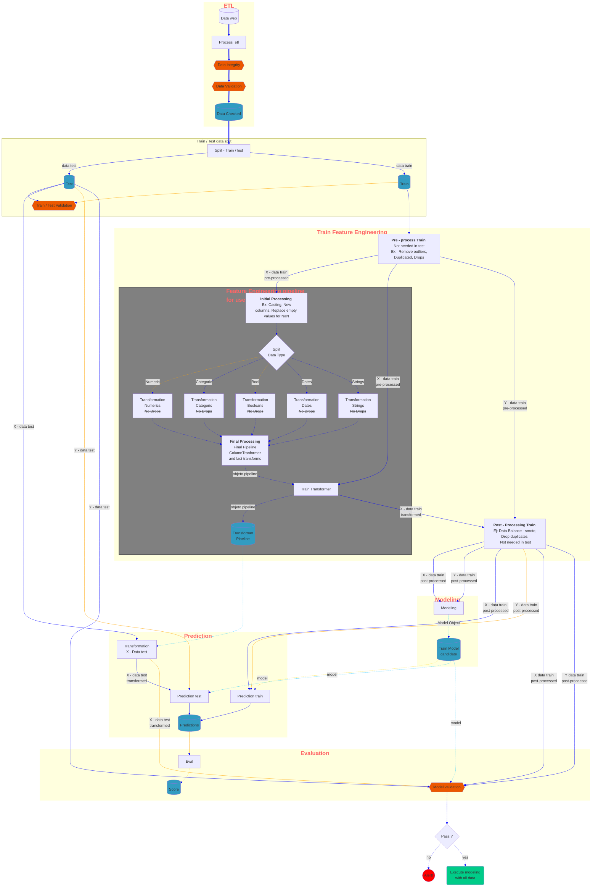
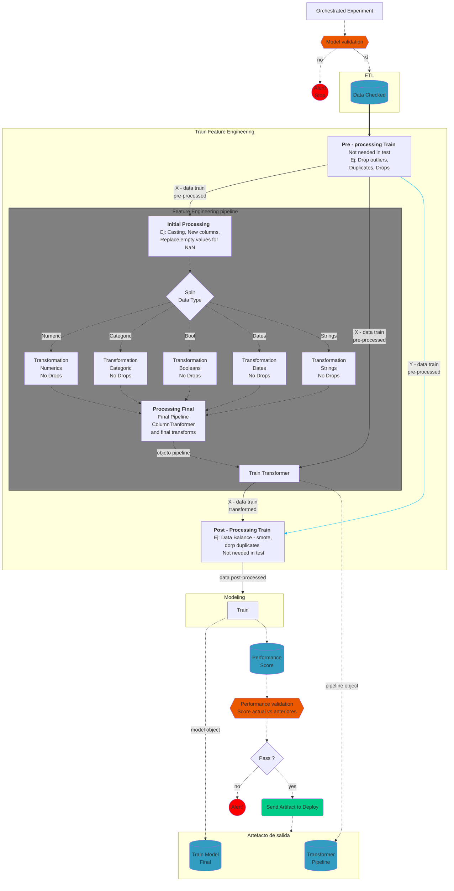

# Demo data science template

[](https://python-poetry.org/)
[](https://github.com/charliermarsh/ruff)
[](https://github.com/pre-commit/pre-commit)
[](https://github.com/JoseRZapata/demo-data-science-template/actions/workflows/test.yml)
[](https://codecov.io/gh/JoseRZapata/demo-data-science-template)
---

This demo of a data science project is created using the template from [@JoseRZapata]'s [data science project template] which have all the necessary tools for experiment, development, testing, and deployment data science From notebooks to production.

> [!WARNING]
> 🚧 Work in progress 🚧, This is a demo project, It is only for educational purposes.

## 🗃️ Project structure

```bash
.
├── codecov.yml                         # configuration for codecov
├── .code_quality
│   ├── bandit.yaml                     # bandit configuration
│   ├── mypy.ini                        # mypy configuration
│   └── ruff.toml                       # ruff configuration
├── data
│   ├── 01_raw                          # raw immutable data
│   ├── 02_intermediate                 # typed data
│   ├── 03_primary                      # domain model data
│   ├── 04_feature                      # model features
│   ├── 05_model_input                  # often called 'master tables'
│   ├── 06_models                       # serialized models
│   ├── 07_model_output                 # data generated by model runs
│   ├── 08_reporting                    # reports, results, etc
│   └── README.md                       # description of the data structure
├── docs                                # documentation for your project
├── .editorconfig                       # editor configuration
├── .github                             # github configuration
│   ├── actions
│   │   └── python-poetry-env
│   │       └── action.yml              # github action to setup python environment
│   ├── dependabot.md                   # github action to update dependencies
│   ├── pull_request_template.md        # template for pull requests
│   └── workflows
│       ├── docs.yml                    # github action to build documentation (mkdocs)
│       ├── pre-commit_autoupdate.yml   # github action update pre-commit hooks
│       └── test.yml                    # github action to run tests
├── .gitignore                          # files to ignore in git
├── Makefile                            # useful commands to setup environment,
├── models                              # store final models
├── notebooks
│   ├── 1-data                          # notebooks for data extraction and cleaning
│   ├── 2-exploration                   # notebooks for data exploration
│   ├── 3-analysis                      # notebooks for data analysis
│   ├── 4-feat_eng                      # notebooks for feature engineering
│   ├── 5-models                        # notebooks for model training
│   ├── 6-evaluation                    # notebooks for model evaluation
│   ├── 7-deploy                        # notebooks for model deployment
│   ├── notebook_template.ipynb         # template for notebooks
│   └── README.md                       # information about the notebooks
├── .pre-commit-config.yaml             # configuration for pre-commit hooks
├── pyproject.toml                      # dependencies for poetry
├── README.md                           # description of your project
├── src                                 # source code for use in this project
├── tests                               # test code for your project
└── .vscode                             # vscode configuration
    ├── extensions.json                 # list of recommended extensions
    └── settings.json                   # vscode settings
```

## Data Science Code structure

### Orchestrated experiment



### Deployment



## Credits

This project was generated from [@JoseRZapata]'s [data science project template] template.

---
[@JoseRZapata]: https://github.com/JoseRZapata

[bandit]: https://github.com/PyCQA/bandit
[codecov]: https://codecov.io/
[Cookiecutter]:https://cookiecutter.readthedocs.io/stable/
[coverage.py]: https://coverage.readthedocs.io/
[Cruft]: https://cruft.github.io/cruft/
[data science project template]: https://github.com/JoseRZapata/data-science-project-template
[Data structure]: demo-data-science-template/data/README.md
[deepcheck]:https://deepcheck.io/
[dependabot]: https://github.com/dependabot/dependabot-core
[depy]:https://fpgmaas.github.io/deptry/
[DVC]:https://dvc.org/
[github actions]: https://github.com/features/actions
[hydra]: https://hydra.cc/
[Jupyter]:https://jupyter.org/
[Makefile]: https://www.gnu.org/software/make/manual/make.html
[MlFlow]:https://www.mlflow.org/
[Mypy]: http://mypy-lang.org/
[Notebook template]: demo-data-science-template/notebooks/notebook_template.ipynb
[NumPy]:https://numpy.org/
[OmegaConf]: https://omegaconf.readthedocs.io/en/latest/
[Pandas]:https://pandas.pydata.org/
[pandera]:(https://pandera.readthedocs.io/en/stable/)
[Poetry]: https://python-poetry.org/
[pre-commit]: https://pre-commit.com/
[Pull Request template]: demo-data-science-template/.github/pull_request_template.md
[Pyenv]: https://github.com/pyenv/pyenv
[pypi]: https://pypi.org/
[Pytest]: https://docs.pytest.org/en/latest/
[pyupgrade]: https://github.com/asottile/pyupgrade
[Ruff]: https://docs.astral.sh/ruff/
[scikit-learn]:https://scikit-learn.org/
